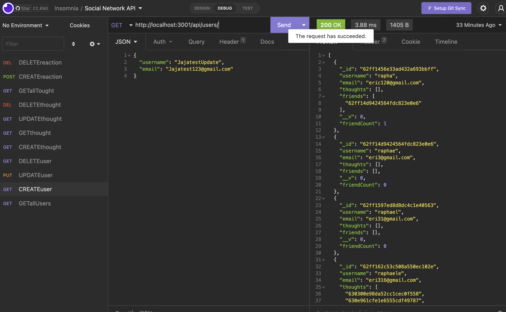

### Social Networker

## Description

Social Networker is an API application where users can create and share their thoughts, react on friends Thoughts.

## Technologies

- Express.js (routing)
- MongoDb (Database)
- Mongoose(ODM)
- Moment.js (Format time)
- Insomnia (seed data into database)

## Installation

> to install this application on your local machine you can clone it or Download.

run npm install to install all dependecies

## License

Social Networker does not have a license

##  Tests

to test the routes created you can use Insomnia to:
- Get all users
- Get single user
- Get all thoughts
- Get single thought
- Delete User
- Delete thoughts
- update User
- update thoughts ...

## Question

If you have question you email me at :

Raphsoneric@gmail.com

## Image

